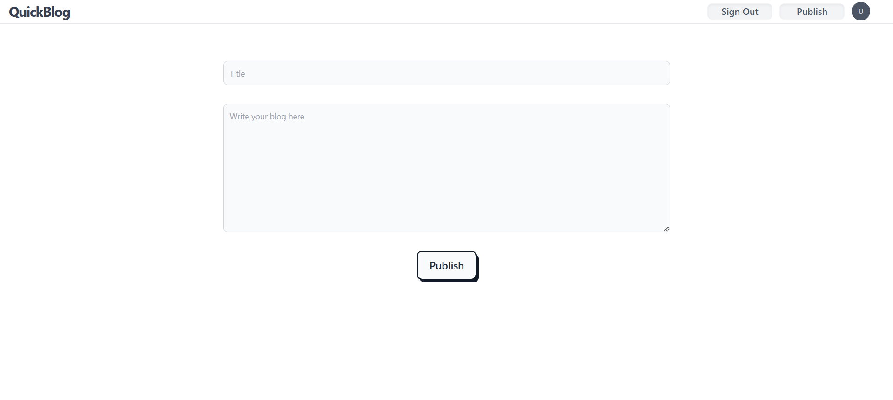

# QuickBlog

QuickBlog is a full-stack blogging platform built to provide a scalable, high-performance and secure space for users to create, share and explore blogs

## Features

- Responsive user interface with Tailwind CSS
- Built with TypeScript for enhanced type safety
- Serverless backend for low-latency responses and high scalability
- Robust data validation and type safety with Zod and secure user authentication using JWT
- Common module deployment for consistent validation logic across frontend and backend

## Technologies Used

### Frontend:

- **React** - For building dynamic and interactive user interfaces.
- **Tailwind CSS** - For styling and responsive design.

### Backend:

- **Cloudflare Workers** - For serverless backend deployment.
- **Hono** - Lightweight web framework for handling HTTP requests.

### Database:

- **PostgreSQL** - As the primary database for storing application data. 
- **Prisma** - A next-generation ORM for type-safe and efficient database access.

### Validation and Security:

- **Zod** - For schema-based validation and type inference.
- **JWT** - For secure user authentication and session management.

## Visual Overview

### Signup Interface

### Login Interface

### Discover Blogs Page

### Read Blog Interface

### Publish Blog Interface
